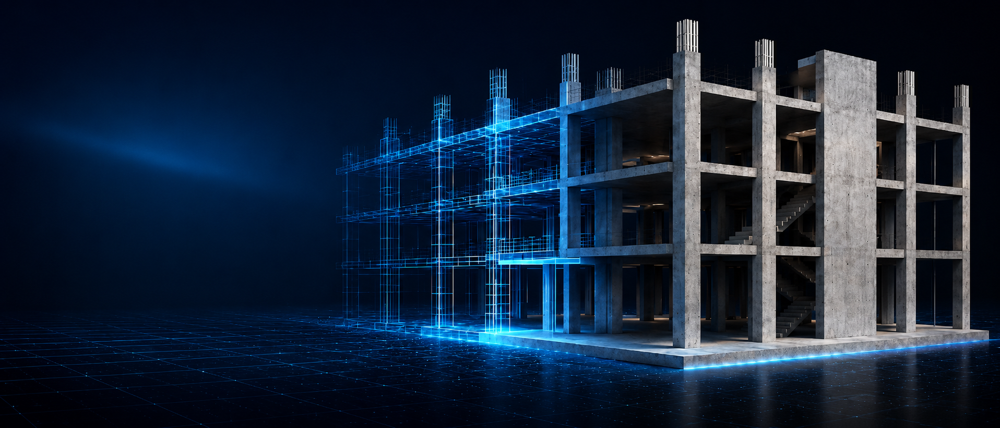

# TechCycle26-Structflow

<p align="center">
  
</p>

<p align="center">
  <strong>İstinat duvarı ön tasarımı, mühendislik kontrolleri ve sürdürülebilirlik değerlendirmesi için bütünleşik masaüstü çalışma alanı.</strong>
</p>

<p align="center">
  
  
  
  
  
</p>

## Proje hakkında

**TechCycle26-Structflow**, istinat duvarı tasarım sürecindeki geometri, zemin parametreleri, stabilite kontrolleri, betonarme ön tasarım, metraj, maliyet ve çevresel etki değerlendirmelerini tek bir çalışma alanında birleştiren mühendislik yazılımıdır.

Uygulama **Next.js + React + TypeScript** tabanlı arayüzü, **Electron** masaüstü katmanı ve proje verilerini saklayan `.sfl` dosya formatıyla çalışır. Bu repository yalnızca **istinat duvarı** ürününü içerir.

> [!IMPORTANT]
> Hesap sonuçları ön tasarım ve karar desteği amacı taşır. Nihai uygulama projesi; yürürlükteki standartlar, proje koşulları ve yetkili mühendis kontrolü doğrultusunda ayrıca doğrulanmalıdır.

## Öne çıkan yetenekler

| Alan | Kapsam |
| --- | --- |
| **Geometri & zemin** | Duvar geometrisi, temel boyutları, dolgu ve zemin parametreleri |
| **Toprak basıncı** | Coulomb tabanlı aktif/pasif yanal toprak basıncı hesabı |
| **Stabilite** | Kayma, devrilme ve taşıma gücü kontrolleri |
| **Betonarme** | ACI CODE-318-25 kapsamındaki betonarme kesit/donatı ön tasarımı; geoteknik hesaplardan ayrı |
| **3B çalışma alanı** | Three.js / React Three Fiber tabanlı görselleştirme |
| **Metraj & maliyet** | Beton, donatı ve ilişkili miktar/maliyet sonuçları |
| **Sürdürülebilirlik** | Beton reçetesi, CO₂e, malzeme etkileri ve alternatif değerlendirmeleri |
| **Lojistik** | Harita tabanlı konum ve lojistik iş akışları |
| **Raporlama** | Excel ve PDF çıktıları |
| **Proje dosyası** | Sürümlenebilir `.sfl` proje formatı, açma/kaydetme ve migration desteği |

## Hızlı başlangıç

### Gereksinimler

- **Node.js 22.12+**
- **npm**
- Masaüstü çalışma için desteklenen bir Windows geliştirme ortamı

### Kurulum

```bash
git clone https://github.com/geniusprr/istinat-duvari.git
cd istinat-duvari
npm ci
```

### Masaüstü uygulamasını çalıştırma

```bash
npm run electron:dev
```

### Yalnızca web arayüzünü çalıştırma

```bash
npm run dev
```

Varsayılan geliştirme sunucusu `http://localhost:3000` adresinde açılır.

## Temel komutlar

| Komut | İşlev |
| --- | --- |
| `npm run dev` | Next.js geliştirme sunucusunu başlatır |
| `npm run electron:dev` | Electron + Next.js masaüstü geliştirme ortamını başlatır |
| `npm run build` | Production Next.js build'i üretir |
| `npm run electron:compile` | Electron TypeScript kaynaklarını derler |
| `npm run electron:build` | Windows masaüstü paketleme zincirini çalıştırır |
| `npm run typecheck` | TypeScript tip kontrolünü çalıştırır |
| `npm test` | Vitest testlerini çalıştırır |
| `npm run lint` | ESLint kontrolünü çalıştırır |
| `npm run docs:file-map` | Dosya bazlı teknik indeksi yeniler |
| `npm run licenses:inventory` | Üçüncü taraf npm lisans envanterini yeniler |
| `npm run video:studio` | Remotion Studio'yu başlatır |
| `npm run video:render` | Tanıtım videosunu render eder |

## Mimari

```text
src/app
  ↓
src/shell
  ↓
src/retaining-wall
  ↓
src/core
  ↓
desktop/electron
```

- `src/app/` — Next.js uygulama giriş katmanı.
- `src/shell/` — proje merkezi, sekmeler, çalışma alanı yaşam döngüsü ve açma/kaydetme akışı.
- `src/retaining-wall/` — istinat duvarı state, hesap motoru, UI, raporlama ve sürdürülebilirlik alanı.
- `src/core/` — `.sfl` proje formatı, ortak sözleşmeler, standartlar ve tema altyapısı.
- `desktop/electron/` — native dosya I/O, IPC, pencere ve masaüstü yaşam döngüsü.
- `public/` — logo, ikon, texture ve diğer runtime statik varlıklar.
- `tooling/` — dokümantasyon, lisans envanteri ve Remotion yardımcıları.
- `docs/` — teknik dokümantasyon.
- `artifacts/` — kaynak kod olmayan geçmiş, geçici veya üretilen çıktılar.

Daha ayrıntılı mimari için [`docs/architecture.md`](docs/architecture.md) belgesine bakın.

Hesap yöntemleri, benchmark değerleri, formüller, varsayımlar ve veri-kaynağı politikası için [`docs/methodology.md`](docs/methodology.md) belgesine bakın. Nihai yöntem sınırı: yanal toprak basıncında **Coulomb**, taşıma gücünde **Terzaghi**, betonarme tasarımda yalnız **ACI CODE-318-25**. Beton reçeteleri bu standartların tanımladığı reçeteler olarak sunulmaz; reçete, fiyat ve emisyon verileri kendi kaynak metadata'sıyla izlenir.

## Proje dosya formatı

Structflow projeleri **`.sfl` v3** formatında saklanır. Dosya ZIP tabanlı bir kapsayıcıdır ve temel olarak `project.json` ile `metadata.json` içerir.

Güncel proje tipi:

```text
retaining-wall
```

Eski istinat projesi formatları açılış sırasında güncel şemaya normalize edilir. Ayrıntılar için [`docs/project-data.md`](docs/project-data.md) belgesine bakın.

## Teknoloji yığını

**Frontend:** Next.js 16, React 19, TypeScript, Zustand, Tailwind CSS<br />
**Desktop:** Electron 41<br />
**3B:** Three.js, React Three Fiber, Drei<br />
**Harita:** Leaflet, React Leaflet<br />
**Raporlama:** ExcelJS, jsPDF<br />
**Veri & doğrulama:** Zod<br />
**Grafikler:** Recharts<br />
**Test:** Vitest<br />
**Medya:** Remotion

Kesin bağımlılık sürümleri `package.json` ve `package-lock.json` dosyalarında tutulur.

## Dokümantasyon

Teknik belgeler `docs/` altında düzenlenmiştir:

- [`docs/README.md`](docs/README.md) — dokümantasyon giriş noktası
- [`docs/architecture.md`](docs/architecture.md) — katmanlar, sınırlar ve veri akışı
- [`docs/file-map.md`](docs/file-map.md) — dosya bazlı sorumluluk indeksi
- [`docs/development.md`](docs/development.md) — geliştirme, build ve doğrulama akışı
- [`docs/methodology.md`](docs/methodology.md) — hesap yöntemi, formüller, benchmark ve veri kökeni
- [`docs/project-data.md`](docs/project-data.md) — `.sfl`, migration ve persistence
- [`docs/retaining-wall.md`](docs/retaining-wall.md) — istinat hesap/state/UI mimarisi
- [`docs/desktop.md`](docs/desktop.md) — Electron güvenlik modeli ve native I/O
- [`docs/legal/README.md`](docs/legal/README.md) — proje lisansı ve üçüncü taraf lisans belgeleri

## Lisans ve kullanım hakları

Bu repository **açık kaynak lisansıyla dağıtılmamaktadır**. Kaynak kod public olarak görüntülenebilir olsa da proje **proprietary / All Rights Reserved** statüsündedir.

İzin verilmedikçe kaynak kodun veya proje varlıklarının kullanılması, kopyalanması, değiştirilmesi, yeniden dağıtılması, yayınlanması, ticari olarak kullanılması ya da türev çalışma oluşturulması için lisans verilmez.

Tam koşullar için [`LICENSE`](LICENSE) dosyasını okuyun. Üçüncü taraf bağımlılıklar kendi lisansları altında kalır ve [`docs/legal/THIRD-PARTY-NOTICES.md`](docs/legal/THIRD-PARTY-NOTICES.md) içinde ayrıca envanterlenir.

> [!NOTE]
> Repository'nin public olması, kaynak kod için otomatik olarak açık kaynak kullanım izni verildiği anlamına gelmez.

## Sorumluluk reddi

Bu yazılım, ön değerlendirme ve hızlı yaklaşık hesaplamalar için mühendislik karar desteği sağlar. Sunulan sonuçlar ön tasarım ve karşılaştırma amacıyla kullanılmalı; nihai uygulama öncesinde proje koşulları ve ilgili teknik gereklilikler doğrulanmalıdır.

---

<p align="center">
  <strong>TechCycle26-Structflow</strong><br />
  Engineering analysis · Retaining wall design · Sustainability
</p>
